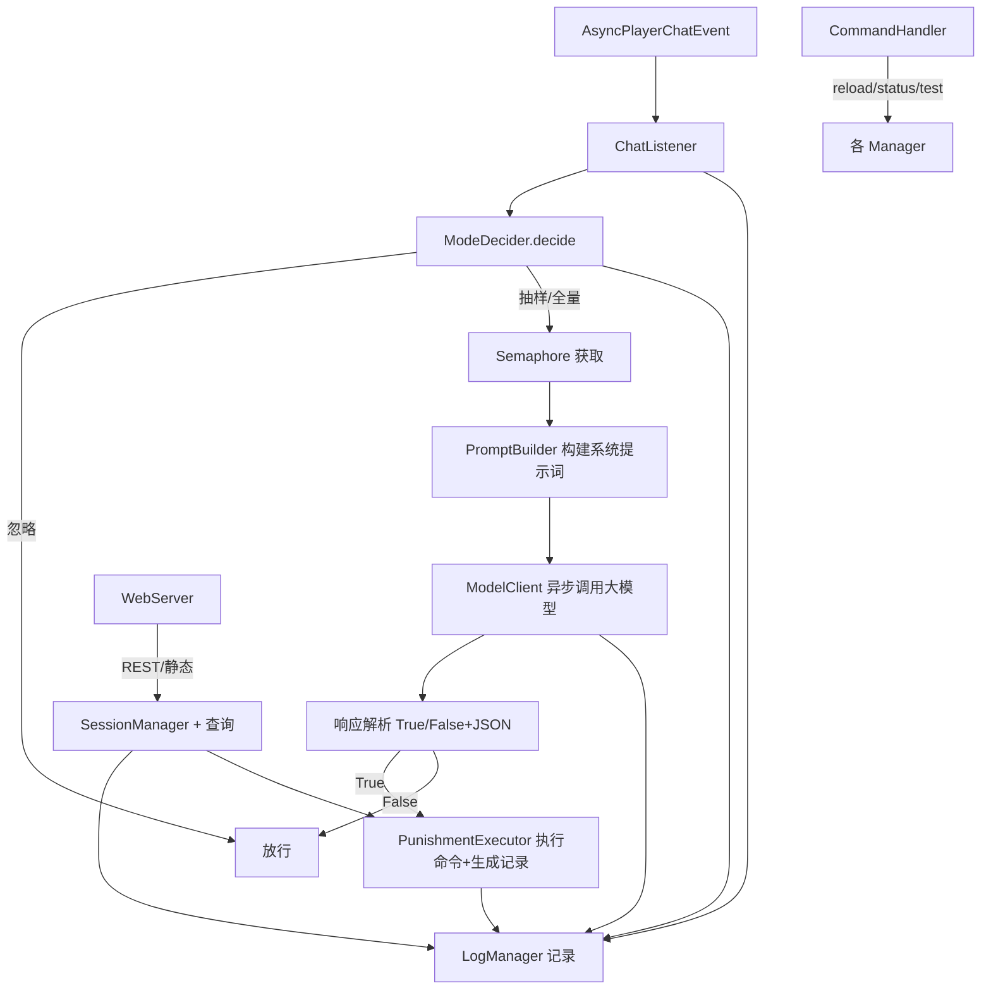

## 产品概述

本插件是一个基于大语言模型的 Minecraft（Paper/Bukkit，Java 17）服务器聊天合规检测系统，插件名 ChatModerator。依据在线管理员与玩家数量动态切换检测强度，调用可自定义系统提示词的大模型 API 深度识别混淆违禁词，并自动执行处罚。同时提供日志归档、处罚记录查询、内建 Web 管理面板与游戏内命令，且支持运行时热重载。

## 核心功能

- **智能模式决策**：依据活跃 OP 数与在线玩家数实时切换「关闭/抽样/全量」三档检测，每次聊天事件即时计算并缓存状态。
- **自定义提示词检测**：加载模型/全局/内置三级优先级的系统提示词模板，将 `{{BANNED_WORDS_JSON}}` 占位符替换为违禁词列表后调用大模型，支持管理员完全自定义检测逻辑与输出格式。
- **文本标准化与解析**：内置零宽字符移除、NFKC 规范化、同形字符映射、小写等标准化管道；按三行约定（行号/True-False/JSON）解析模型响应，失败时按可配置策略降级。
- **自动处罚与存档**：命中后按模板以控制台身份执行命令（变量防注入），生成结构化处罚记录 JSON 存入 punishments/。
- **日志系统**：每小时滚动日志、每日凌晨 tar.gz 打包归档、按保留期自动清理。
- **Web 管理面板**：NanoHTTPD 内嵌服务，访客可搜处罚记录，管理员 BCrypt 登录后查看完整日志，支持多维筛选。
- **热重载与命令**：`/chatmod reload`、`/status`、`/test` 命令，运行时重载配置、词库、提示词与模型信息。

## 技术栈选型

- **语言/平台**：Java 17，Paper/Bukkit API（按服务器实际版本对齐，如 1.21.x）。
- **构建**：Maven（pom.xml），使用 maven-shade-plugin 将依赖 relocation 后打进单一插件 jar。
- **HTTP 客户端**：JDK 内置 `java.net.http.HttpClient`（原生异步、零额外依赖），配合独立 `ExecutorService` 与 `Semaphore` 控制并发。
- **内嵌 Web**：NanoHTTPD 2.3.1（轻量、单 jar、随插件 shade）。
- **JSON**：Google Gson（配置、模型、惩罚记录、日志序列化）。
- **归档**：Apache Commons Compress（tar.gz 打包与解包）。
- **密码哈希**：`at.favre.lib:bcrypt`（现代、纯 Java、Maven Central 可用）。

## 实现方案

### 总体策略

以 `ChatModeratorPlugin`（JavaPlugin）为装配中心，各功能拆分为独立 Manager/Handler，主类 `onEnable` 中初始化并注册。聊天检测链路全程异步，主线程仅做事件判断与命令回调，避免卡顿。

### 关键决策与取舍

1. **JDK HttpClient 替代 OkHttp**：减少第三方依赖与 shade 体积，原生 `sendAsync` 返回 `CompletableFuture`，契合异步 + 重试 + 信号量控制需求。
2. **Semaphore + 固定线程池**：`max_concurrent_requests` 控制并发上限，`retry_count` 在 future 异常时重试；超时用 `orTimeout` 触发失败策略（放行/本地备用关键词检测，可配）。
3. **三级提示词优先级**：模型配置 `system_prompt_template` > 全局 `custom_prompt_template` > 内置默认，统一由 `PromptBuilder` 读取并替换 `{{BANNED_WORDS_JSON}}`，模板缺失占位符时回退注入以保兼容。
4. **日志缓冲落盘**：`LogManager` 用单写线程 + 阻塞队列批量写入，降低 I/O 次数；按小时文件命名，调度器每日 `log_archive_hour` 打包前一日并清理超期包。
5. **Web 鉴权**：`SessionManager` 基于 Cookie 的会话（30 分钟超时），管理员密码 BCrypt 校验；路由分访客/管理员两级，静态资源由 NanoHTTPD 从 `web/` 目录提供。
6. **命令防注入**：`punishment_command` 变量替换时对 `{playerName}` 做非法字符过滤（去除命令分隔符与空白截断），仅以控制台身份 `dispatchCommand`。

### 性能与可靠性

- 模式决策 O(在线玩家) 但维护缓存，仅状态变化时重算；AFK 监听仅记录时间戳，无锁读多写少。
- API 调用不阻塞游戏线程；并发受信号量约束，防止瞬时大量消息击垮模型服务。
- 日志高频写入走队列，主路径不等待落盘；归档与清理在独立调度线程，避开高峰期。

## 实现要点（防回归）

- 相对路径配置均以 `getDataFolder()` 为基准（`config.yaml`、`models/`、`banned_words/`、`prompts/`、`logs/`、`punishments/`、`web/`）。
- 资源默认值随插件打包（`src/main/resources`），首次启用写入数据目录，重载不覆盖用户已改文件（仅缺失时生成）。
- `plugin.yml` 注册主类、`AsyncPlayerChatEvent` 监听与 `chatmod` 命令；命令权限仅 OP。
- 模型响应解析容错：行数不足/JSON 非法时按失败策略处理并记录错误日志，不抛异常中断主流程。
- shade 时对 NanoHTTPD、Gson、Commons Compress、bcrypt 做 package relocation，避免与服务器其他插件冲突。

## 架构设计



## 目录结构

```
LLMChatGuard/
├── pom.xml                         # [NEW] Maven 构建：依赖 Paper API(provided)、NanoHTTPD、Gson、Commons Compress、bcrypt；shade 插件打包。
├── src/main/resources/
│   ├── plugin.yml                  # [NEW] 插件元数据：主类、命令 chatmod、API 版本。
│   ├── config.yaml                 # [NEW] 默认主配置（§9 全部字段），首次运行时写入数据目录。
│   ├── models/default.json         # [NEW] 默认模型配置示例（§5.2 字段）。
│   ├── prompts/default_prompt.txt  # [NEW] 内置默认提示词模板（含标准化步骤、三行输出格式、{{BANNED_WORDS_JSON}} 占位符）。
│   └── web/                        # [NEW] Web 面板静态资源（HTML/CSS/JS），NanoHTTPD 直接托管。
└── src/main/java/com/chatmoderator/
    ├── ChatModeratorPlugin.java    # [NEW] JavaPlugin 主类，装配所有 Manager，注册监听/命令，启动 Web 与调度。
    ├── config/
    │   ├── ConfigManager.java      # [NEW] 加载/热重载 config.yaml 与 web_admin 凭据（BCrypt 识别明文/哈希）。
    │   └── ModelConfig.java        # [NEW] 解析 models/*.json，提供 api_url/key/参数/提示词路径。
    ├── afk/
    │   └── AFKManager.java         # [NEW] 监听移动/聊天/命令更新最后活跃时间，判定 AFK（排除 NPC）。
    ├── mode/
    │   └── ModeDecider.java        # [NEW] 依据活跃 OP 数/在线玩家数决策 STOP/SAMPLE/FULL，维护状态缓存。
    ├── words/
    │   └── WordFilter.java         # [NEW] 扫描 banned_words/*.txt 合并去重，支持热重载。
    ├── prompt/
    │   └── PromptBuilder.java      # [NEW] 三级优先级解析提示词，替换 {{BANNED_WORDS_JSON}} 占位符。
    ├── model/
    │   ├── ModelClient.java        # [NEW] 基于 HttpClient 的异步调用封装：信号量并发、超时、重试、失败策略。
    │   └── ModelResponse.java      # [NEW] 响应解析结果（isBanned、bannedWords），含三行解析与容错。
    ├── listener/
    │   └── ChatListener.java       # [NEW] AsyncPlayerChatEvent 监听，串联决策→检测→处罚→日志。
    ├── punishment/
    │   ├── PunishmentExecutor.java # [NEW] 变量安全替换、控制台执行命令、生成 punish_<UUID>_<ts>.json。
    │   └── PunishmentRecord.java   # [NEW] 处罚记录数据结构（玩家/违禁词/命令/原文/时间）。
    ├── log/
    │   ├── LogManager.java         # [NEW] 队列异步写日志、小时滚动、每日 tar.gz 归档、保留期清理调度。
    │   └── LogEntry.java           # [NEW] 日志条目（JSON 行格式：时间/类型/内容）。
    ├── web/
    │   ├── WebServer.java          # [NEW] NanoHTTPD 服务，路由 /、/punishments、/logs、/login、/logout 与静态资源。
    │   ├── SessionManager.java     # [NEW] Cookie 会话、BCrypt 登录校验、超时失效。
    │   └── QueryService.java       # [NEW] 处罚/日志查询与筛选（按玩家/时间/结果）。
    └── command/
        └── CommandHandler.java     # [NEW] /chatmod reload|status|test 实现，仅 OP 可用。
```

## 关键代码结构

```java
public enum DetectMode { STOP, SAMPLE, FULL }

public class ModelResponse {
    public boolean isBanned;          // 第二行 True/False（忽略大小写）
    public List<String> bannedWords;  // 第三行 JSON {"banned_words":[...]}
    public boolean parsed;            // 解析是否成功，失败走降级策略
}

// PromptBuilder 关键约定
public final class PromptBuilder {
    public static final String PLACEHOLDER = "{{BANNED_WORDS_JSON}}";
    // resolveTemplate(String rawTemplate, List<String> bannedWords) -> String
}
```

## 设计风格

面向服务器管理员的轻量运维面板，采用深色科技风（Dark Glassmorphism）管理后台风格：深蓝灰背景、半透明卡片、青色高亮强调、圆角与柔和阴影。页面响应式，桌面优先，导航栏固定顶部，主体以卡片网格与表格呈现数据。管理员视图相比访客视图多出日志筛选区。整体克制专业，避免花哨。

## 页面规划（3 页）

### 1. 主页 / 仪表盘（GET /）

- 顶部导航栏：站点名、模式状态徽章、登录/注销入口。
- 状态卡片：当前检测模式、在线人数、活跃 OP 数、队列等待数（仅管理员可见详细）。
- 最近处罚列表：最新 10 条处罚摘要（玩家、词、时间），访客与管理员同享。
- 底部页脚：数据目录与版本信息。

### 2. 处罚记录查询（GET /punishments）

- 顶部导航栏（同上）。
- 搜索栏：按玩家名搜索 + 分页控件（访客可用）。
- 处罚表格：玩家、违禁词、执行命令、时间、详情展开。
- 空状态与分页提示块。

### 3. 日志查看（GET /logs，仅管理员）

- 顶部导航栏 + 管理员标识。
- 筛选栏：类型（chat/detection）、玩家名、起止时间、触发结果。
- 日志时间线/表格：时间、类型、内容摘要，支持展开原文。
- 导出/刷新按钮块。

## 字体与配色

- 字体：系统无衬线栈（PingFang SC / Segoe UI / Roboto），标题 20px/600，副标题 15px/500，正文 14px/400。
- 主色：青色 #2DD4BF；背景：#0F172A / 卡片 #1E293B；文本：#E2E8F0 / 次要 #94A3B8；功能色：成功 #22C55E、危险 #EF4444、链接 #38BDF8。